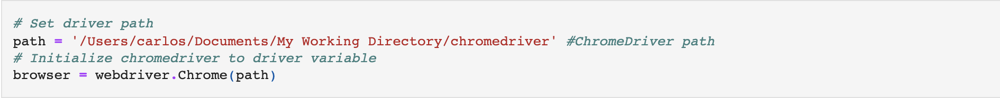
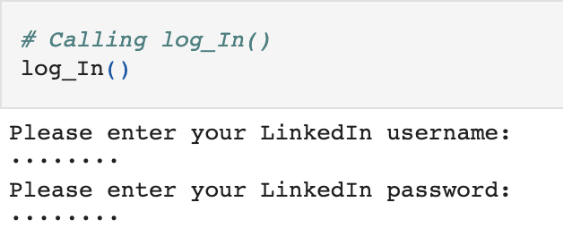
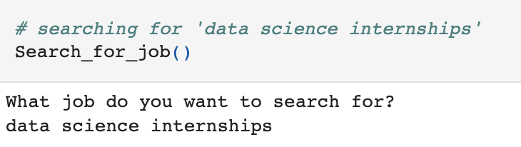
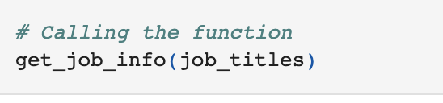
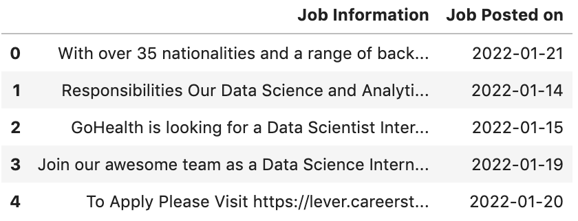
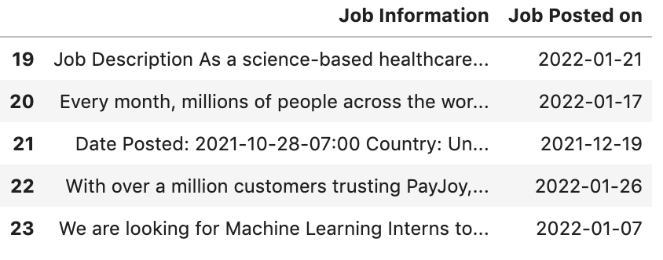

# LinkedIn-Scraper

### Quick Overview

This is a LinkedIn Job Scraper I created using BeautifulSoup & Selenium.

The idea behind this scraper is that the user inputs what kind of jobs he/she is looking for, and the scraper scrapes the job information for the jobs listed on the 1st page of the search input.

This [blog post](https://levelup.gitconnected.com/linkedin-scrapper-a3e6790099b5) led my research into scraping and gave me my starting points on how to tackle this project.

Please view the [full code](https://github.com/ckelaid/LinkedIn-Scraper/blob/main/LinkedIn%20Scraper.ipynb) for details.

## How to Use

To begin, as the user, set your driver path to wherever you have the browser's driver located, and initialize the driver. 

Then, run the **log_In()** function where you will be asked to input your *username* & *password* to log-into LinkedIn.

Once logged in, run the **Search_for_job()** function, where you will be asked to input what jobs you wish to search for: 

The **Search_for_job()** function will return an array, *job_titles*, with links to the individual page of each listing that appears after your search.

After running **Search_for_job()**, run **get_job_info()** with *job_titles* as input: 

Once **get_job_info()** is done running, you will have the description of each job that was listed as well as the date the job was posted on. You can store them in a dataframe like so:

 

**Note**: A worthy addition would be to scrape the *Company Name* as well.
